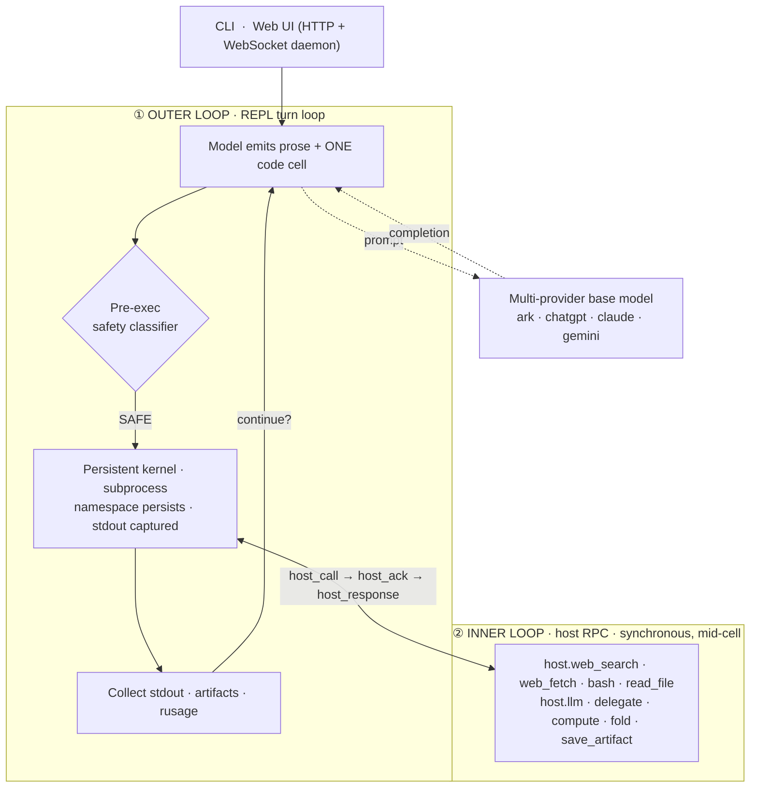

# Architecture — the Code-as-Action dual loop

OpenAI4S drives the model with a **dual loop**: an outer REPL *turn* loop, and an inner synchronous *host-RPC* loop that runs **inside** a single code cell.



- **① Outer loop** — the REPL *turn* loop: the model produces a turn (prose + one code cell), the cell is screened and executed in the persistent kernel, results/costs are collected, and the loop decides whether to continue. A task ends only when the agent calls `host.submit_output(...)`.
- **② Inner loop** — *within a single cell*, agent code can call `host.llm(...)` / `host.delegate(...)` / `host.compute(...)` any number of times. Each is a synchronous `host_call → host_ack → host_response` RPC on a channel **separate from stdout capture**, so the cell blocks, the host services the call mid-execution, and the cell resumes. **This inner RPC loop does not exist in a `tool_use` architecture** — there, actions are atomic and never call back into the host mid-execution.

## The `host` singleton

Everything the agent can do is a call on the in-kernel `host` singleton ([`openai4s/sdk/host.py`](../openai4s/sdk/host.py)):

```python
host.web_search(...)   host.web_fetch(...)   host.bash(...)          # networked tools
host.read_file / write_file / edit_file / grep / glob / list_dir     # filesystem (workspace-jailed)
host.llm(...)          host.delegate(...)    host.collect(...)       # models & sub-agents
host.compute.create(...).submit_job(...)   host.fold(...)            # remote GPU (BYOC) + folding
host.save_artifact(...) host.artifacts(...) host.view_image(...)     # versioned artifacts
host.skills.*  host.env.use(...)  host.mcp.call(...)  host.query(...) # skills, envs, MCP, read-only SQL
host.submit_output(...)                                              # the only way to end a task
```

## Key design points

- **Persistent namespace** across cells (real kernel semantics); big objects stay in kernel memory.
- **stdout/stderr captured** so `print` never corrupts the protocol wire; **per-cell linecache tags** give accurate `error_lineno`.
- **Synchronous host RPC mid-execution** — `host.llm(...)` blocks the cell, the host services it, the cell resumes.
- **`getrusage`-based accounting** (wall / cpu / peak_rss) per cell.
- **Bounded-depth delegation** — `host.delegate(...)` spawns concurrent sub-agents running the same loop (fanout cap 48, session cap 1000); children at `MAX_DEPTH` (4) become leaves that cannot re-delegate.
- **Context compaction** — older turns are summarized past a token threshold; raw slices archived to disk.

The engine is **pure Python stdlib**: the kernel is a subprocess speaking a hardened JSON-per-line protocol, the LLM client speaks OpenAI / Anthropic / Gemini wires over `urllib`, and the daemon is `http.server` + a hand-rolled WebSocket — no framework, no third-party dependency in the core.
